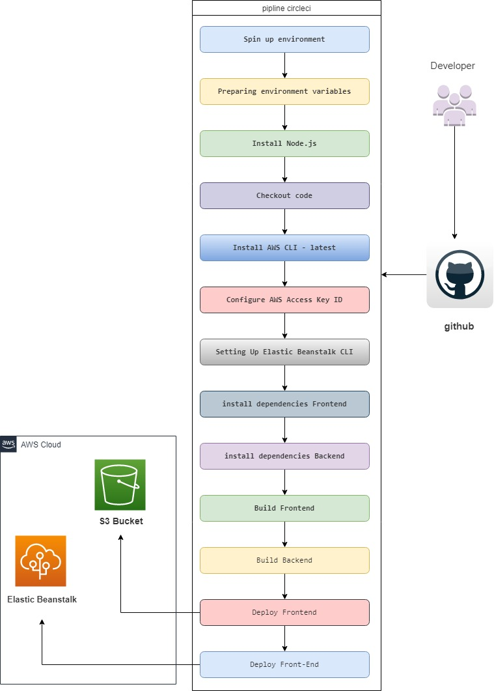

# Pipeline Process

The pipeline is set up and connected with this GitHub repository in CircleCI.

## Order of commands

1. The pipeline uses orbs to install Node, the AWS CLI, and the EB CLI.

2. It checks out the code from the repo

3. FrontEnd & BackEnd install

```text
Backend:
    Node: 16.13.2
    aws-sdk: ^2.429.0,
    bcrypt: ^5.0.1,
    cors: ^2.8.5,
    dotenv: ^8.2.0,
    express: ^4.16.4,
    jsonwebtoken: ^8.5.1,
    pg: ^8.7.1,
    chai: ^4.2.0,
    chai-http: ^4.2.1,
    eslint: ^6.8.0,
    eslint-config-google: ^0.14.0,
    mocha: ^6.1.4,
    ts-node-dev: ^1.0.0-pre.32,
    typescript: ^3.3.4000

Frontend:
    @angular/common: ^8.2.14,
    @ionic-native/core: ^5.0.0,
    core-js: ^2.5.4,
    rxjs: ~6.5.4,
    zone.js: ~0.9.1
    jasmine-core: ~2.99.1,
    jasmine-spec-reporter: ~4.2.1,
    karma: ~3.1.4,
    typescript: ^3.5.3
```

4. FrontEnd & BackEnd build to www/ folder

5. FrontEnd deploy into s3 bucket

6. BackEnd deploy on the AWS Elastic Beanstalk service



