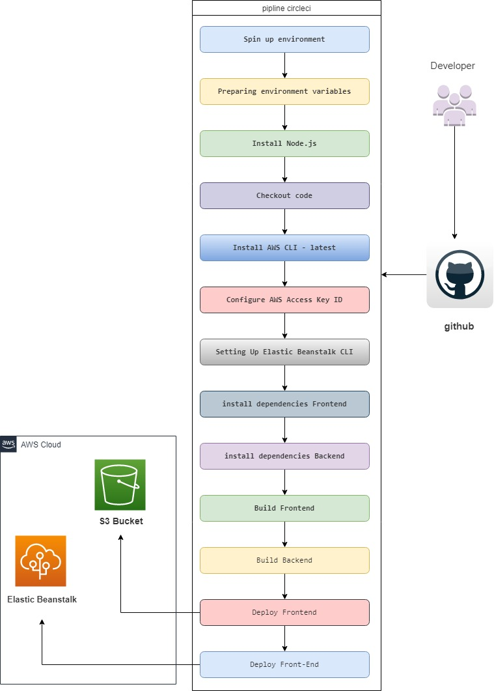
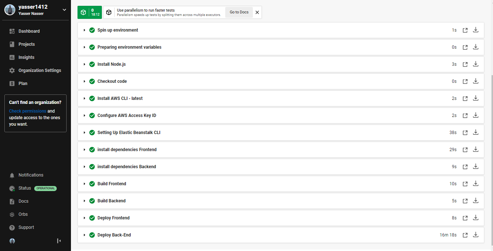

# Pipeline Process

The pipeline is set up and connected with this GitHub repository in CircleCI.

## Order of commands

1. The pipeline uses orbs to install Node, the AWS CLI, and the EB CLI.

2. It checks out the code from the repo

3. FrontEnd & BackEnd dependancies install

4. FrontEnd & BackEnd build to www/ folder

5. FrontEnd deploy into s3 bucket

6. BackEnd deploy on the AWS Elastic Beanstalk service

